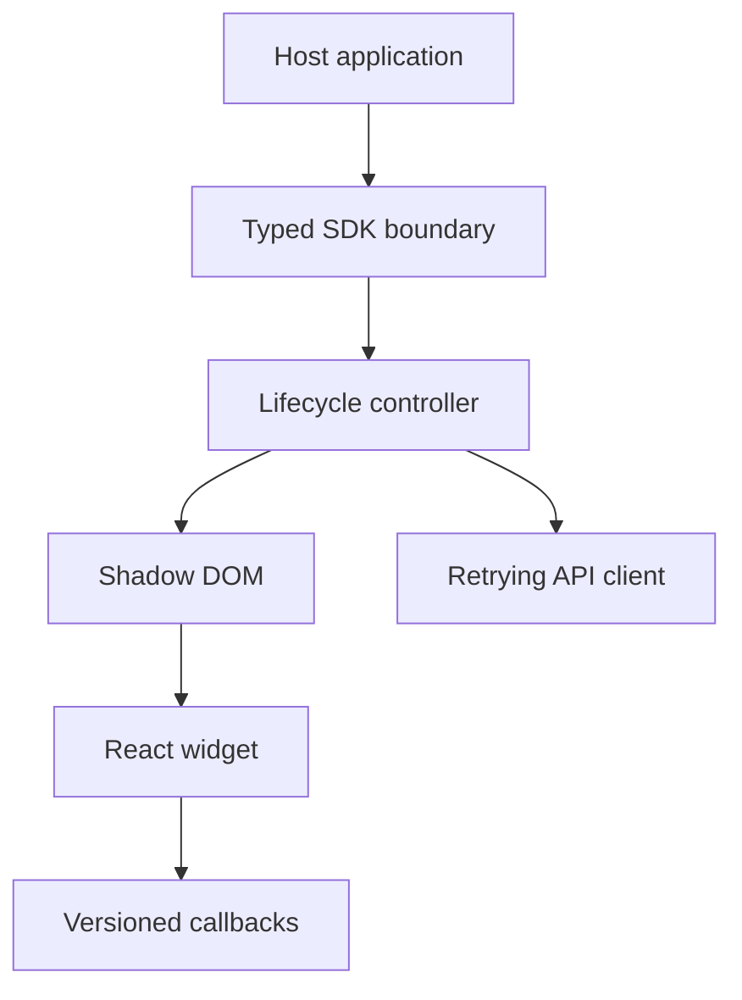

# Embeddable Widget SDK

A TypeScript and React widget designed to be integrated into applications I do not control. It provides a small public API, asynchronous loading, bounded retries, style isolation, accessible states and an integration example.

```ts
const widget = ProductWidget.init({
  apiKey: "demo_public_key",
  container: "#product-widget",
  theme: "light",
  locale: "en",
  onEvent: (event) => console.log(event.type, event.payload),
});
```

## What it is

The package renders an engagement card into a host page. React is an internal implementation detail: integrators receive a stable SDK surface and do not need to use React themselves.

## Why I built it

Embedded products have unusual constraints. The host can have conflicting CSS, remove the mount point, load slowly, enforce a restrictive layout or expect lifecycle callbacks. This repository concentrates on that boundary rather than pretending the widget owns the page.

## Quick start

```html
<div id="product-widget"></div>
<script src="https://cdn.example.test/product-widget.umd.js"></script>
<script>
  ProductWidget.init({
    apiKey: "demo_public_key",
    container: "#product-widget",
    theme: "auto"
  });
</script>
```

The URL is illustrative. Build the package locally or use the example app; this repository does not claim a published CDN release.

## Installation

```bash
npm install
npm run dev
```

Or run the isolated integration example with Docker:

```bash
docker compose up --build
```

Build the distributable library:

```bash
npm run build
```

## Initialization

`ProductWidget.init(config)` validates configuration synchronously and returns a `WidgetInstance`.

| Option | Type | Required | Description |
|---|---|---:|---|
| `apiKey` | `string` | yes | Public integration identifier. Never use a secret server key. |
| `container` | `string \| HTMLElement` | yes | Mount target or CSS selector. |
| `apiBaseUrl` | `string` | no | HTTPS API base URL; defaults to the demo adapter. |
| `theme` | `light \| dark \| auto` | no | Visual theme. |
| `locale` | `en \| de` | no | Interface language. |
| `accentColor` | CSS color | no | Scoped accent token. |
| `timeoutMs` | `number` | no | Request timeout, 1–15 seconds. |
| `onEvent` | function | no | Lifecycle and interaction callback. |

## Public API

```ts
interface WidgetInstance {
  update(next: Partial<WidgetConfig>): void;
  refresh(): Promise<void>;
  destroy(): void;
}
```

Multiple instances can run on one page. Calling `destroy()` unmounts React and removes the shadow root host created by the SDK.

## Events

`ready`, `load_failed`, `retry`, `cta_clicked`, `updated`, and `destroyed` are emitted through `onEvent`. Payloads are deliberately small and versioned by event name.

## Error handling and retries

- Invalid configuration throws a typed `WidgetError` before mounting.
- `401`/`403` responses are not retried.
- Network failures and `5xx` responses retry at most twice with exponential backoff and jitter.
- The UI exposes a manual retry action after the retry budget is exhausted.
- Callbacks are isolated so an exception in host code does not break the widget.

## Style isolation and accessibility

The widget mounts inside a Shadow DOM boundary. It resets only its own elements, uses CSS custom properties for supported theming, preserves visible focus, announces loading/error state, and supports reduced motion and narrow containers.

## Architecture



## Local development

```bash
npm install
npm run typecheck
npm test
npm run dev
```

The example app uses a deterministic demo adapter by default and can simulate a failure from its controls.

## Troubleshooting

- **Container not found:** initialize after the target element exists, or pass the element directly.
- **Nothing loads:** verify the public API key, `apiBaseUrl`, CSP and browser network panel.
- **Unexpected colors:** use `theme` and `accentColor`; host CSS should not cross the Shadow DOM boundary.
- **Duplicate widget:** retain the returned instance and call `destroy()` before remounting.

## Versioning

The public API follows semantic versioning. New optional configuration and events are minor changes; removals or behavior changes require a major version. Events should be handled defensively so unknown future event types can be ignored.

## Future improvements

- Publish signed bundles with integrity metadata.
- Add CSP and iframe deployment examples.
- Add browser matrix tests and visual regression checks.
- Add an opt-in telemetry contract with explicit consent controls.

## License

[MIT](LICENSE)
